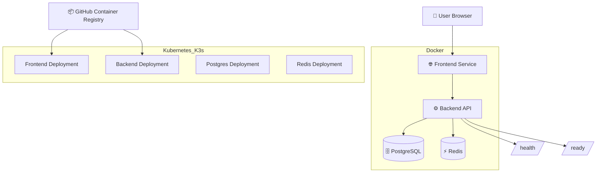

# Merge PR #15 first if it is still open
if gh pr view 15 --json state --jq .state 2>/dev/null | grep -q OPEN; then
  gh pr checks 15 --watch
  gh pr merge 15 --merge --delete-branch
fi

git checkout main
git pull origin main
git checkout -b feature/polish-project-readme

cat > README.md <<'EOF'
# 🚀 LegacyOps 2026 — Hybrid DevOps Portfolio Project


---

## 📌 Project Overview

**LegacyOps 2026** is a production-style DevOps portfolio project built to demonstrate a real-world software delivery workflow.

The project simulates a **Legacy Retail Operations System** and shows how a full-stack application can be containerized, validated, deployed, and documented using modern DevOps practices.

This project includes:

- 🐳 Docker containerization
- 🧩 Docker Compose local orchestration
- ⚙️ GitHub Actions CI validation
- 📦 GHCR container image workflow
- 🧪 Jenkins pipeline validation
- ☸️ Kubernetes deployment using K3s
- ⛵ Helm chart deployment
- 🗄️ PostgreSQL database service
- ⚡ Redis cache service
- 📄 Deployment proof documentation
- 🔁 Clean GitHub branch and pull request workflow

---

## 🎯 Project Goal

The goal of this project is to prove practical DevOps skills by building and validating an end-to-end deployment workflow.

This is not only a code repository. It is a complete DevOps delivery project showing:

```text
Code
↓
Docker Build
↓
Docker Compose Validation
↓
CI/CD Validation
↓
Container Registry
↓
Kubernetes Deployment
↓
Helm Packaging
↓
Deployment Proof
```

---

## ✅ Project Status

| Area | Status |
|---|---|
| Backend application | ✅ Completed |
| Frontend application | ✅ Completed |
| PostgreSQL integration | ✅ Completed |
| Redis integration | ✅ Completed |
| Dockerfiles | ✅ Completed |
| Docker Compose stack | ✅ Completed |
| GitHub Actions CI | ✅ Completed |
| GHCR image workflow | ✅ Completed |
| Jenkins validation | ✅ Completed |
| Kubernetes manifests | ✅ Completed |
| K3s deployment proof | ✅ Completed |
| Helm chart | ✅ Completed |
| Helm deployment proof | ✅ Completed |
| Documentation | ✅ Completed |

---

## 🧱 Architecture



---

## 🛠️ Tech Stack

| Category | Technology |
|---|---|
| Version Control | Git, GitHub |
| CI/CD | GitHub Actions |
| Additional CI | Jenkins |
| Containerization | Docker |
| Local Orchestration | Docker Compose |
| Container Registry | GitHub Container Registry |
| Kubernetes | K3s |
| Kubernetes Packaging | Helm |
| Backend Runtime | Backend API Service |
| Frontend Runtime | Nginx-served frontend |
| Database | PostgreSQL |
| Cache | Redis |
| Documentation | Markdown proof files |

---

## 📁 Repository Structure

```text
legacyops-application/
├── .github/
│   └── workflows/
│       └── GitHub Actions CI workflows
│
├── backend/
│   └── Backend application source
│
├── frontend/
│   └── Frontend application source
│
├── docs/
│   ├── API_CONTRACT.md
│   ├── DATABASE_SCHEMA.md
│   ├── DEVELOPER_PROMPT_USED.md
│   ├── DEVOPS_HANDOFF_NOTES.md
│   ├── helm-deployment-proof.md
│   ├── jenkins-pipeline-proof.md
│   ├── kubernetes-deployment-proof.md
│   └── kubernetes-home-lab-validation.md
│
├── helm/
│   └── legacyops/
│       └── Helm chart for Kubernetes deployment
│
├── k8s/
│   └── base/
│       ├── backend.yaml
│       ├── configmap.yaml
│       ├── frontend.yaml
│       ├── kustomization.yaml
│       ├── namespace.yaml
│       ├── postgres.yaml
│       ├── redis.yaml
│       └── secret.yaml
│
├── docker-compose.yml
└── README.md
```

---

## 🐳 Run Locally with Docker Compose

### 1. Start the full stack

```bash
docker compose up -d --build
```

### 2. Check running services

```bash
docker compose ps
```

### 3. Test frontend

```bash
curl -I http://localhost:3000
```

Expected result:

```text
HTTP/1.1 200 OK
```

### 4. Test backend health

```bash
curl -s http://localhost:8000/health && echo
```

Expected result:

```json
{
  "status": "ok",
  "service": "Legacy Retail Operations System",
  "version": "1.0.0",
  "environment": "docker"
}
```

### 5. Test backend readiness

```bash
curl -s http://localhost:8000/ready && echo
```

Expected result:

```json
{
  "status": "ready",
  "dependencies": {
    "database": "ok",
    "redis": "ok"
  }
}
```

---

## 📦 Container Images

The project uses GitHub Container Registry images for Kubernetes deployment.

```text
Backend:
ghcr.io/lakshaywalia666/legacyops-2026-hybrid-devops/legacyops-backend:latest

Frontend:
ghcr.io/lakshaywalia666/legacyops-2026-hybrid-devops/legacyops-frontend:latest
```

---

## ⚙️ CI/CD with GitHub Actions

GitHub Actions validates the project automatically on push and pull request events.

The CI pipeline validates:

- ✅ Backend checks
- ✅ Frontend checks
- ✅ Docker Compose configuration
- ✅ Docker Compose service startup
- ✅ Pull request quality before merge

Example successful checks:

```text
LegacyOps CI / Backend validation
LegacyOps CI / Frontend validation
LegacyOps CI / Docker Compose validation
```

---

## 🧪 Jenkins Pipeline

This project also includes Jenkins validation to demonstrate hybrid CI/CD experience.

Jenkins proof is documented here:

```text
docs/jenkins-pipeline-proof.md
```

The Jenkins validation proves:

- ✅ Repository checkout
- ✅ Pipeline execution
- ✅ Backend validation
- ✅ Frontend validation
- ✅ CI-style automation outside GitHub Actions

---

## ☸️ Kubernetes Deployment with K3s

LegacyOps is deployed on a local Kubernetes cluster using **K3s**.

### Apply Kubernetes manifests

```bash
kubectl apply -k k8s/base
```

### Check pods

```bash
kubectl get pods -n legacyops -o wide
```

Expected result:

```text
legacyops-backend    1/1 Running
legacyops-frontend   1/1 Running
legacyops-postgres   1/1 Running
legacyops-redis      1/1 Running
```

### Check services

```bash
kubectl get svc -n legacyops -o wide
```

Expected services:

```text
legacyops-frontend   NodePort   80:30080/TCP
legacyops-backend    NodePort   8000:30081/TCP
legacyops-postgres   ClusterIP  5432/TCP
legacyops-redis      ClusterIP  6379/TCP
```

---

## 🌐 Kubernetes Access URLs

Replace `<node-ip>` with your Kubernetes node IP.

```text
Frontend:
http://<node-ip>:30080

Backend health:
http://<node-ip>:30081/health

Backend readiness:
http://<node-ip>:30081/ready
```

Example from the validated home lab deployment:

```text
Frontend:
http://192.168.1.13:30080

Backend:
http://192.168.1.13:30081
```

---

## ✅ Kubernetes Proof

Kubernetes deployment proof is documented here:

```text
docs/kubernetes-deployment-proof.md
```

The proof confirms:

- ✅ All pods are running
- ✅ All deployments are available
- ✅ Frontend returns HTTP 200
- ✅ Backend `/health` returns OK
- ✅ Backend `/ready` confirms PostgreSQL and Redis connectivity

Validated readiness output:

```json
{
  "status": "ready",
  "dependencies": {
    "database": "ok",
    "redis": "ok"
  }
}
```

---

## ⛵ Helm Deployment

The project includes a Helm chart for Kubernetes deployment.

Helm chart path:

```text
helm/legacyops
```

### Install with Helm

```bash
helm upgrade --install legacyops ./helm/legacyops \
  --namespace legacyops \
  --create-namespace
```

### Check Helm release

```bash
helm list -n legacyops
```

### Helm proof

```text
docs/helm-deployment-proof.md
```

---

## 📄 Documentation

| Document | Purpose |
|---|---|
| `docs/API_CONTRACT.md` | API behavior and endpoint contract |
| `docs/DATABASE_SCHEMA.md` | Database schema documentation |
| `docs/DEVOPS_HANDOFF_NOTES.md` | DevOps handoff notes |
| `docs/jenkins-pipeline-proof.md` | Jenkins validation proof |
| `docs/kubernetes-deployment-proof.md` | Kubernetes deployment proof |
| `docs/kubernetes-home-lab-validation.md` | Home lab Kubernetes validation |
| `docs/helm-deployment-proof.md` | Helm deployment proof |

---

## 🔍 Important Health Endpoints

| Endpoint | Purpose |
|---|---|
| `/health` | Confirms backend service is running |
| `/ready` | Confirms backend dependencies are ready |

Example:

```bash
curl -s http://localhost:8000/health && echo
curl -s http://localhost:8000/ready && echo
```

---

## 🔁 Git Workflow Used

This project follows a clean branch and pull request workflow.

```text
main
↓
feature branch
↓
commit
↓
push branch
↓
open pull request
↓
CI checks
↓
merge to main
```

Example branches used:

```text
feature/kubernetes-base
feature/ghcr-kubernetes-images
feature/add-kubernetes-proof
feature/clean-kubernetes-proof-docs
feature/polish-project-readme
```

---

## 🧪 Validation Checklist

| Validation | Status |
|---|---|
| Docker Compose starts successfully | ✅ |
| Frontend returns HTTP 200 locally | ✅ |
| Backend health endpoint works | ✅ |
| Backend readiness checks database and Redis | ✅ |
| GitHub Actions checks pass | ✅ |
| Jenkins proof completed | ✅ |
| Kubernetes manifests render successfully | ✅ |
| Kubernetes pods run successfully | ✅ |
| Kubernetes NodePort frontend works | ✅ |
| Kubernetes backend health works | ✅ |
| Kubernetes backend readiness works | ✅ |
| Helm chart exists | ✅ |
| Helm deployment proof exists | ✅ |

---

## 🧹 Cleanup Commands

### Stop Docker Compose

```bash
docker compose down
```

### Stop Docker Compose and remove volumes

```bash
docker compose down -v
```

### Remove Kubernetes deployment

```bash
kubectl delete namespace legacyops
```

---

## 🧠 Skills Demonstrated

This project demonstrates practical DevOps skills including:

- Building production-style project structure
- Writing Dockerfiles
- Running multi-service apps with Docker Compose
- Creating CI pipelines with GitHub Actions
- Using GitHub pull request workflows
- Publishing and using container images from GHCR
- Running Jenkins validation
- Deploying services to Kubernetes
- Managing Kubernetes Deployments, Services, Secrets, ConfigMaps, and PVCs
- Using NodePort services for local home lab exposure
- Creating Helm charts
- Writing deployment proof documentation
- Debugging service health and readiness

---

## 🚀 Why This Project Matters

LegacyOps 2026 proves that the project is not just code.

It proves the full DevOps lifecycle:

```text
Build → Test → Package → Deploy → Validate → Document
```

This makes the project useful for:

- DevOps engineer portfolio
- Cloud engineer portfolio
- CI/CD practice
- Kubernetes practice
- Docker and containerization practice
- Interview discussion
- Resume project proof

---

## 🔮 Future Improvements

Planned future improvements:

- 🌍 Add Terraform for cloud infrastructure provisioning
- 🛠️ Add Ansible for server configuration automation
- 📊 Add Prometheus and Grafana monitoring
- ☁️ Deploy to AWS, Azure, or GCP
- 🔐 Add sealed secrets or external secret management
- 🚦 Add Ingress controller with custom domain
- 📈 Add autoscaling with Kubernetes HPA
- 🧪 Add deeper automated integration tests

---

## 👨‍💻 Author

**Lakshay Walia**

DevOps learner building real-world, production-style portfolio projects with Docker, CI/CD, Kubernetes, Jenkins, Helm, and cloud-ready practices.

GitHub:

```text
https://github.com/lakshaywalia666
```

---

## ⭐ Final Summary

LegacyOps 2026 is a complete DevOps portfolio project showing:

```text
Docker + Docker Compose + GitHub Actions + GHCR + Jenkins + Kubernetes + Helm + PostgreSQL + Redis + Proof Documentation
```

This project is designed to show practical DevOps ability through working infrastructure, automated validation, and documented deployment proof.

EOF

git add README.md
git commit -m "Polish project README"
git push -u origin feature/polish-project-readme

gh pr create \
  --base main \
  --head feature/polish-project-readme \
  --title "Polish project README" \
  --body "## Summary
- Add a detailed and polished GitHub README
- Document architecture, Docker, CI/CD, Jenkins, Kubernetes, Helm, proof files, and future improvements
- Improve project presentation for portfolio and recruiters

## Validation
- README documentation update only"
